# Image Captioning

This project is an unofficial implementation of the paper [*Show and Tell: A Neural Image Caption Generator*](https://arxiv.org/abs/1411.4555), which generate captioning for input images with resNet50 as the encoder, LSTM as the decoder, and sampling / beam search as 2 different prediction methods. 

## Experiment results
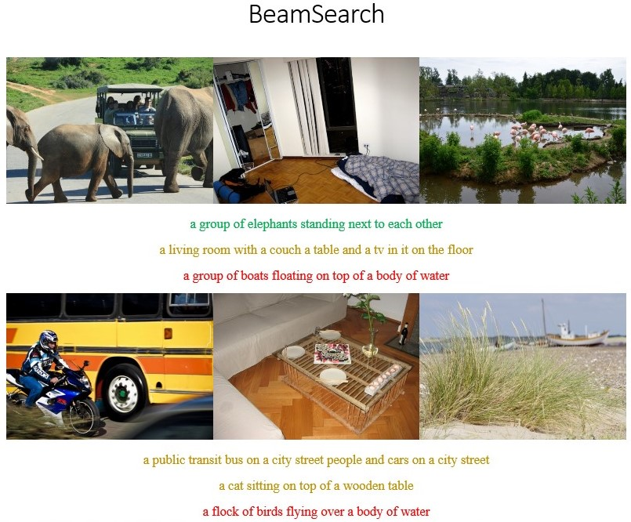
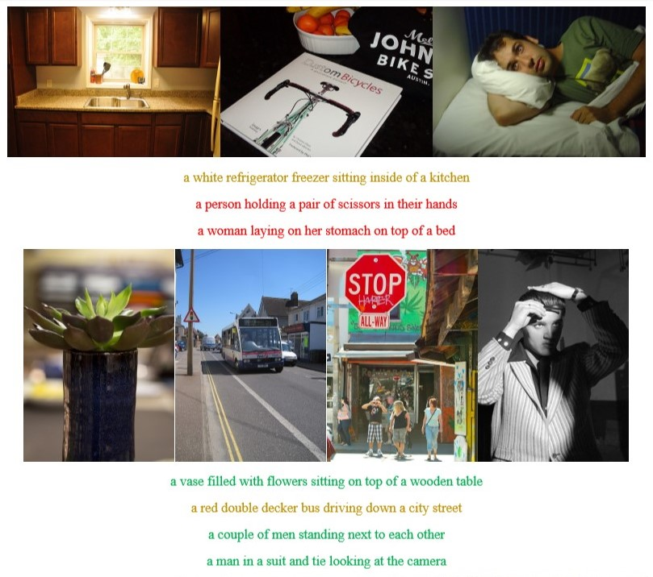
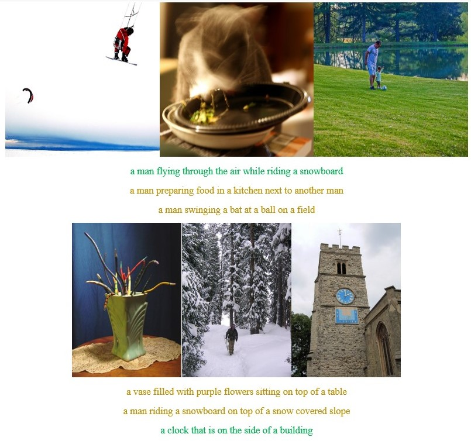
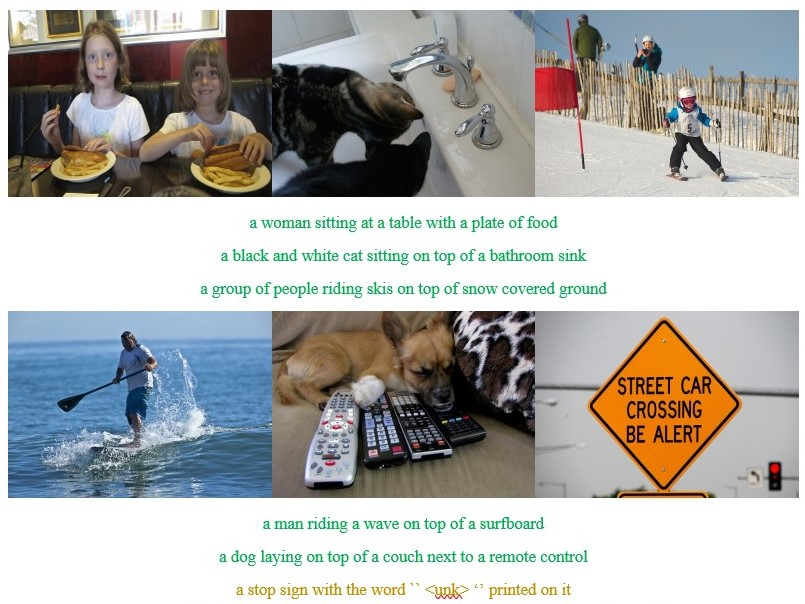
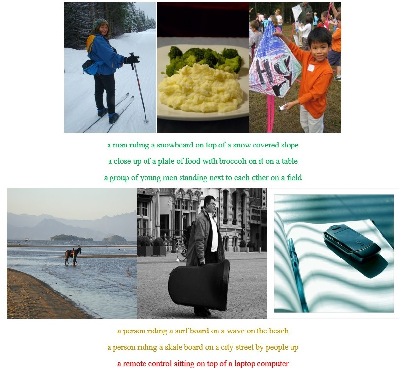
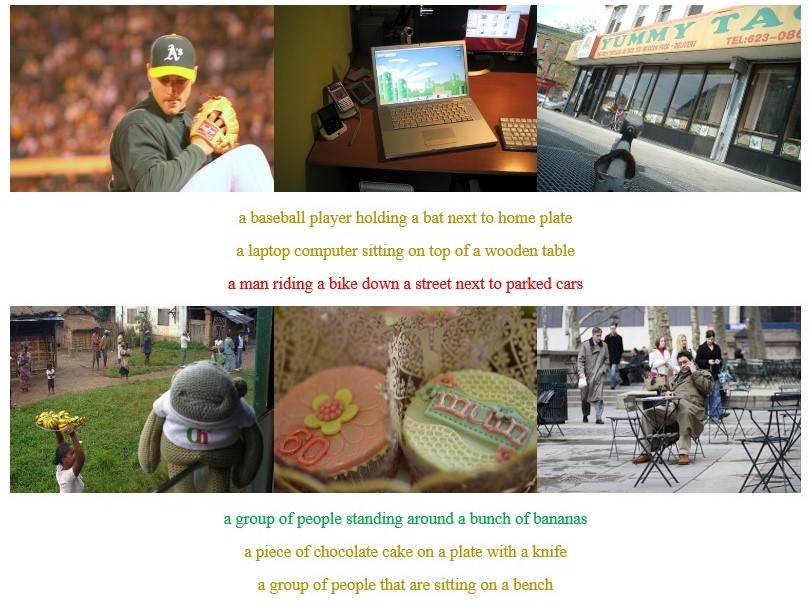
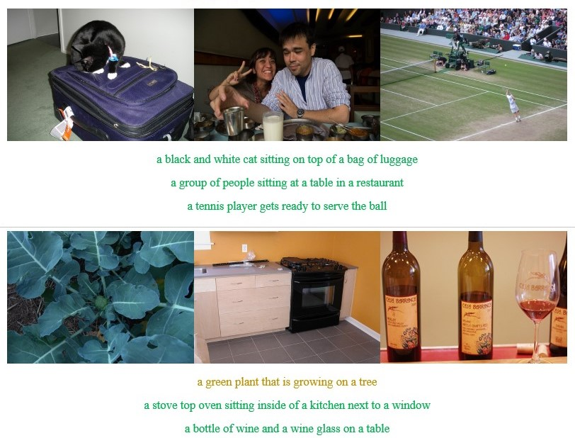
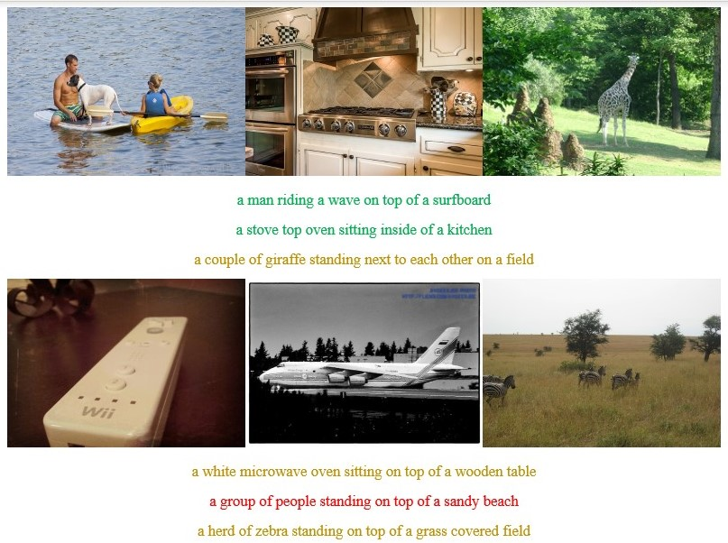
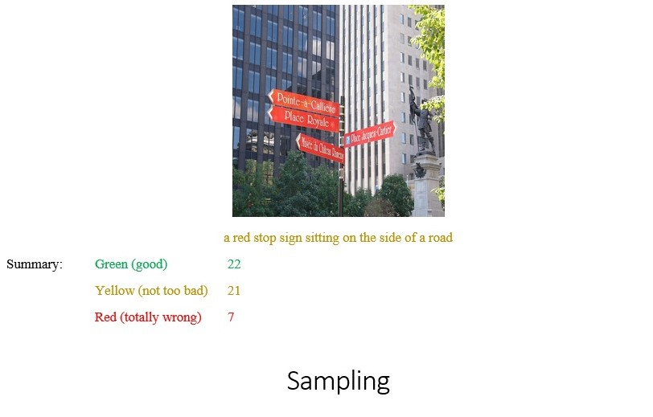

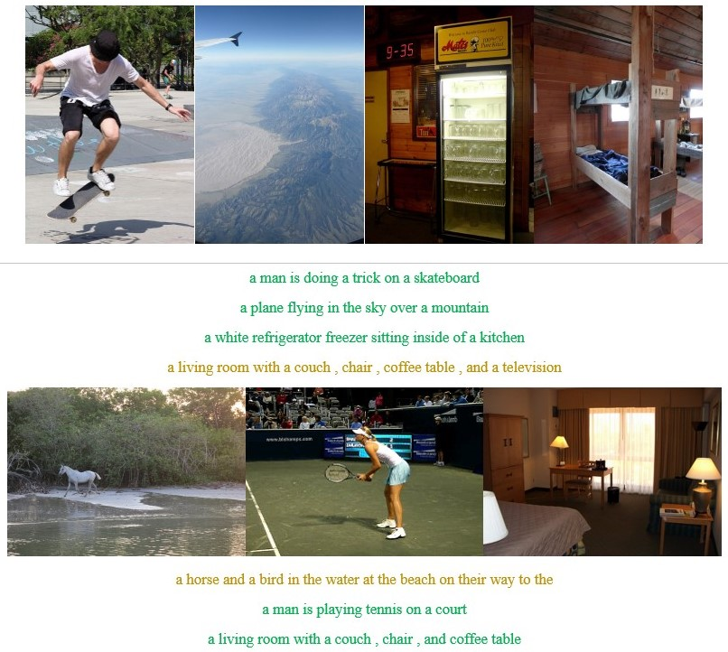
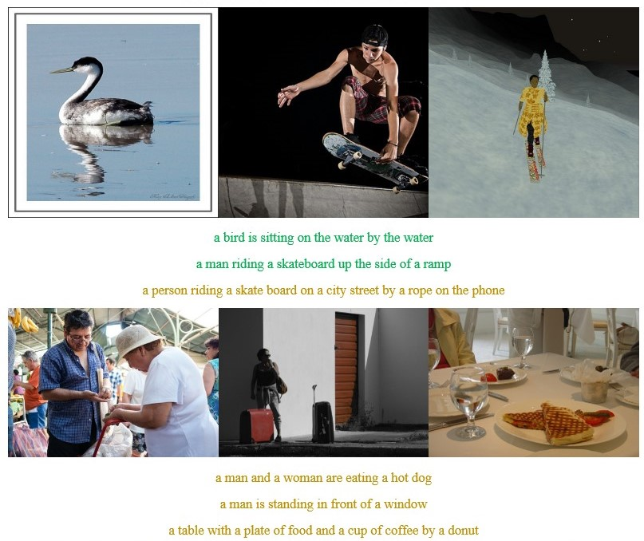
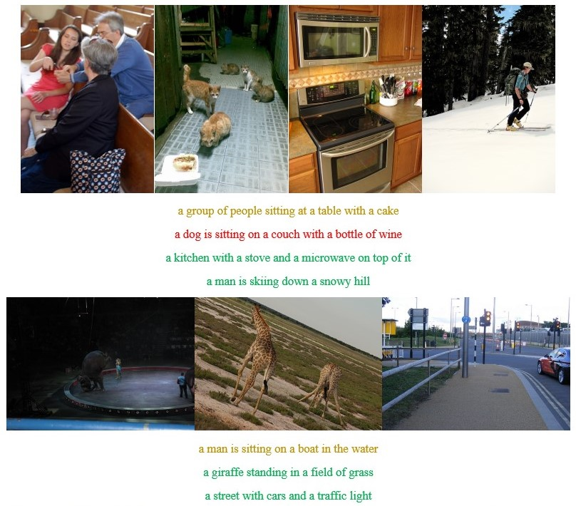
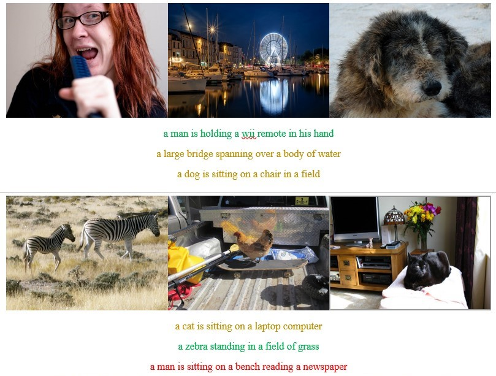
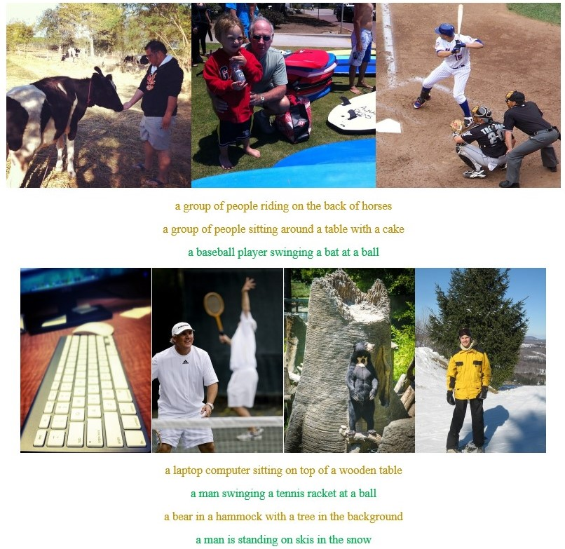
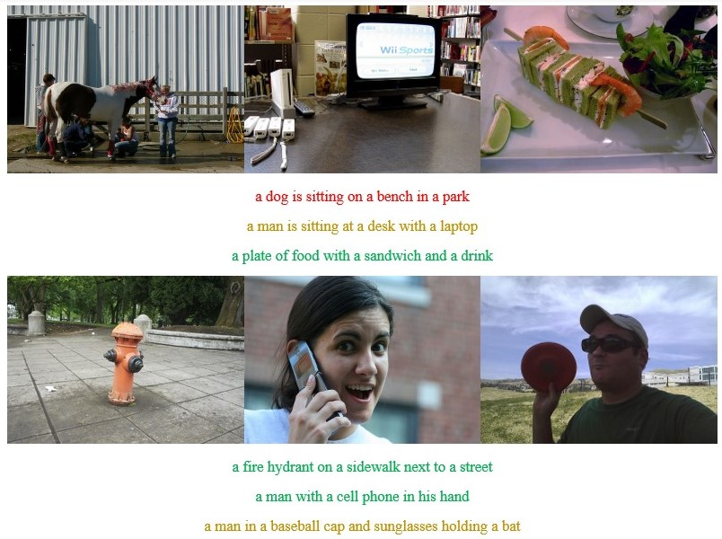
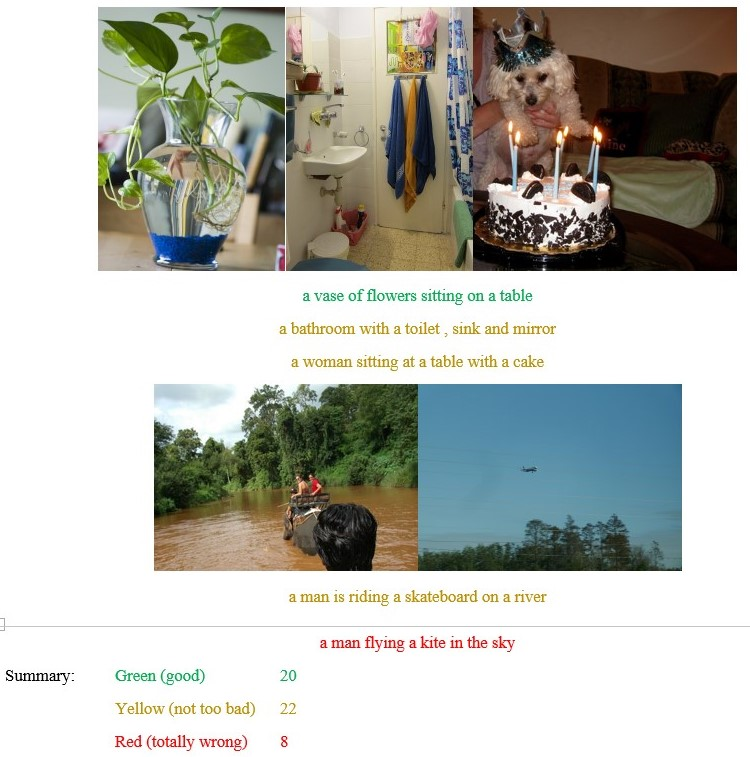

